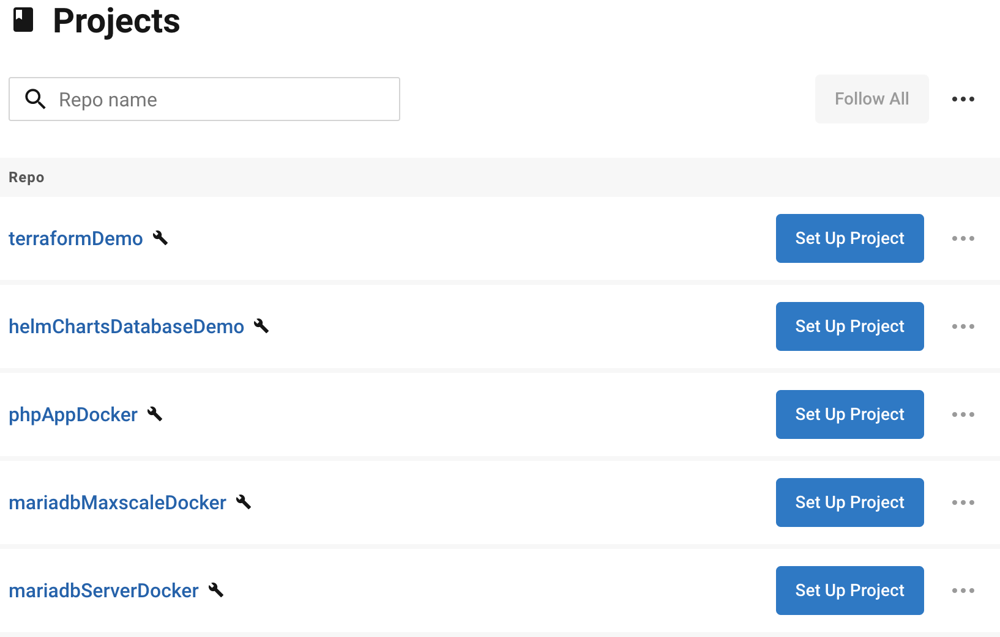
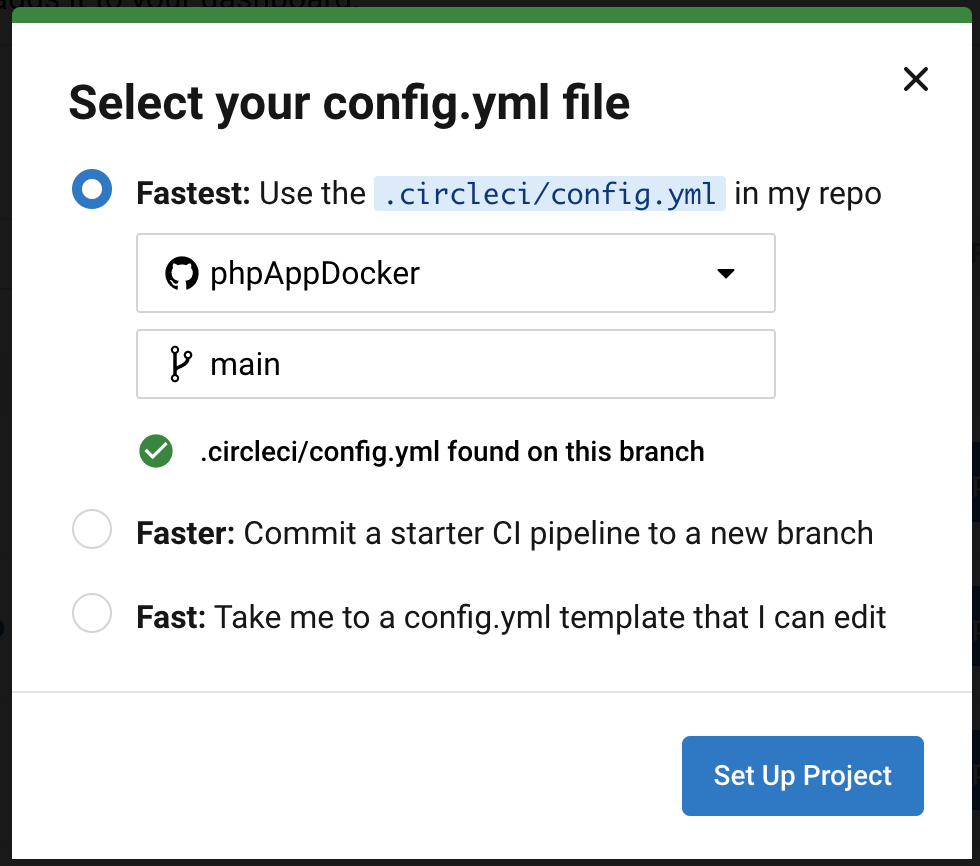
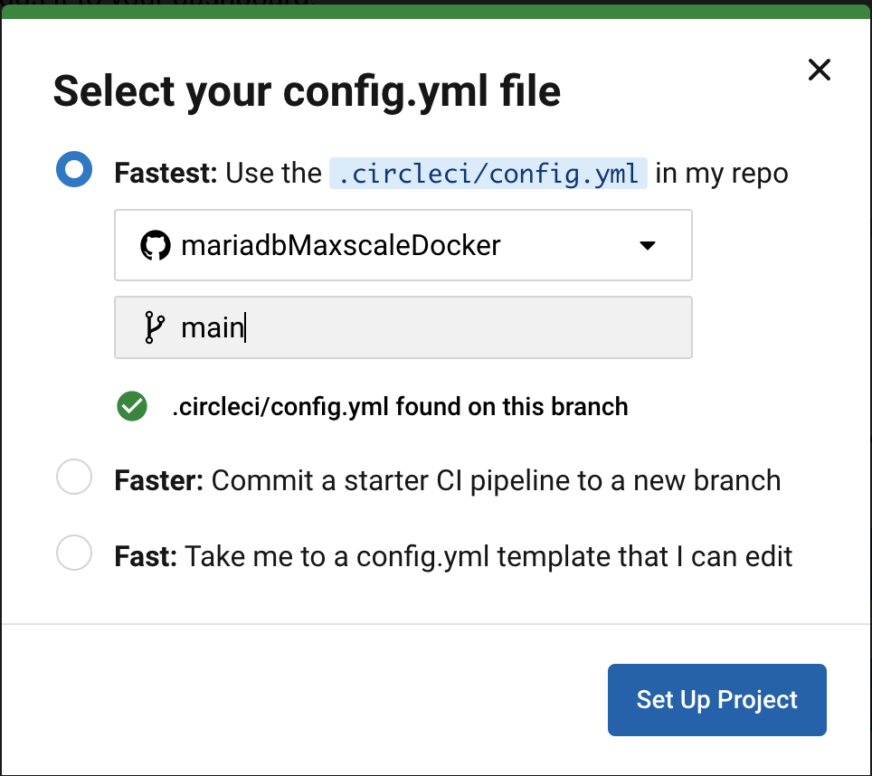
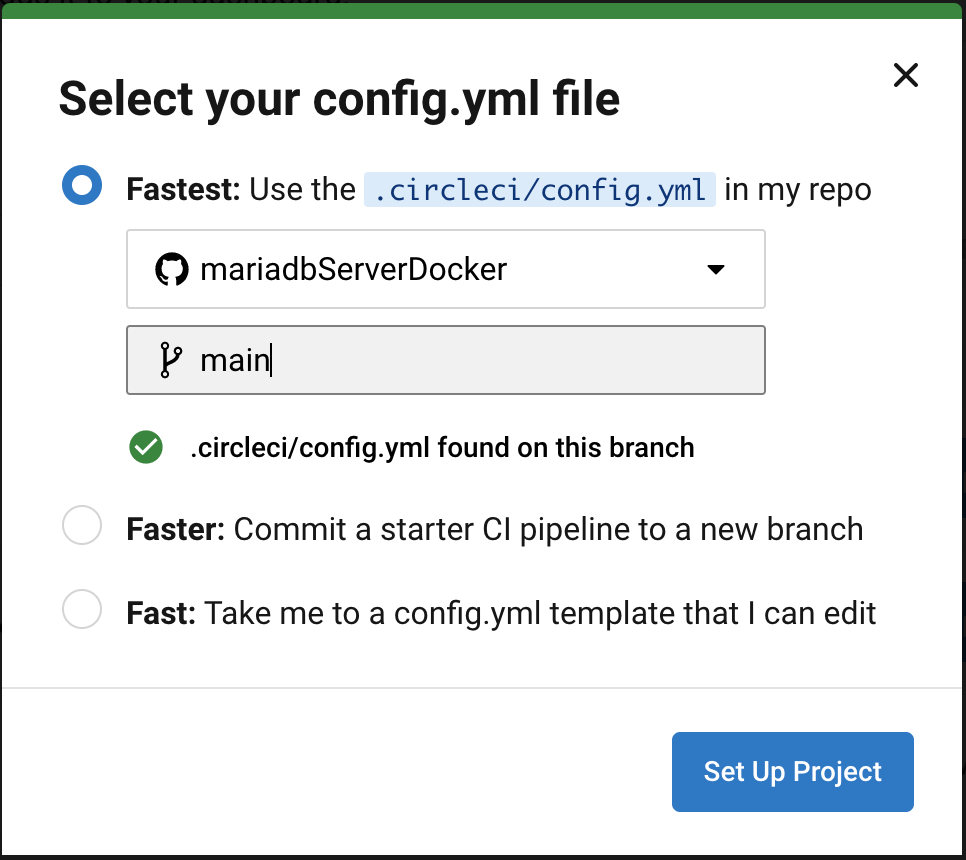

# CircleCI Configuration

Before you run the steps in this guide, ensure you have built
the [DigitalOcean infrastructure](../digitalocean/infrastructure.md).

### Configure CircleCI to use DigitalOcean

Browse to [CircleCI](https://app.circleci.com/pipelines/) and select `Projects` from the menu.

We will be using CircleCI to manage the:

- phpAppDocker
- mariadbMaxscaleDocker
- mariadbServerDocker

For each of **these three projects**, you need to click the `Set Up Project` Button.

----

### Configure phpAppDocker

Start with the `phpAppDocker` project, and you will be presented with a popup box to complete the details. Select
Fastest and type `main` in the branch box. You should then see a Green tick box appear.

Your project will automatically start building and will fail, as we need to complete some other settings.

Select the `Project Settings` option from the top right of the screen.

DO_REPO=registry.digitalocean.com/qtc-systems DO_ACCESS_TOKEN DATABASE DBHOST DBPASS DBUSER

----

### Configure mariadbMaxscaleDocker

----

### Configure mariadbServerDocker

### Configure CircleCI to use MariaDB Enterprise Key